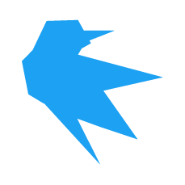

[Cuculus](https://github.com/cuculus-dev)は現在開発中の短文投稿型SNSです。

## Cuculusが目指す未来
X(Twitter)やBluesky、MisskeyやMastodonなどで構成されたFediverseなど、今や様々なSNSに人や情報が分散している状況です。

Cuculusは複数SNSの投稿やタイムライン、ユーザーやフォローといった情報を一つに集約することで、サイトやアプリを切り替える手間を減らしたいと考えています。  

基本的なSNSの開発からにはなりますが、まずは簡易的な投稿サイトとしてミニマムなところから追いかけます。

## アイデア/要望お待ちしています

[Discussions](https://github.com/orgs/cuculus-dev/discussions)からお気軽にどうぞ

<!--

**Here are some ideas to get you started:**

🙋‍♀️ A short introduction - what is your organization all about?
🌈 Contribution guidelines - how can the community get involved?
👩‍💻 Useful resources - where can the community find your docs? Is there anything else the community should know?
🍿 Fun facts - what does your team eat for breakfast?
🧙 Remember, you can do mighty things with the power of [Markdown](https://docs.github.com/github/writing-on-github/getting-started-with-writing-and-formatting-on-github/basic-writing-and-formatting-syntax)
-->
